# Report for Cycle traffic project

**To run the model**
 - Open the folder "Project_Final_Henrik" in vscode (dont just open the src file)
 - Add the "raw_data" folder into the src folder
 - Click on the src/project.py file
 - Run the python file
 - (Running from terminal is not recommended, as paths may be wrong)

**To run the website**
 - Unzip the "app" folder
 - Open the folder "app" in vscode
 - Add the raw data folder to the app folder. 
 - Click on the app.py file
 - Run the python file
  - Wait if needed, as for your first run the model is being built from scratch
 - (Running from terminal is not recommended, as paths may be wrong)
 - Navigate in your browser to http://localhost:8080/

***If I'm not in PDF format, please open me in markdown formatting! (in vscode there is a button with a magnifying glass in the top right.)***

*Henrik Brøgger*

This report pertains to a project for creating a model which can guess bike traffic across Nygårdsbroen.

### Index:

- Issues/Choices
- Data Exploration
- Data processing
- Dropped columns
- Feature engineering
- Results
- Discussion
- Improvements
- Website
- Real life implications
- Conclusion

## Approach and design choices

Given multiple files describing weather, and a single file describing traffic, there were hurdles to get over, and choices to make in order to create a DataFrame which an eventual model could learn from. This was all in order to create a website to allow users to predict cycle traffic over Nygårdsbroen, given the weather conditions.

### Issues/Choices

*Parsing*

Simply opening the traffic data in a nice format was a challenge. The trafficdata.csv uses both "|" and ";" as separators. The solution was to open the file as a string, replace all "|" with ";" and then open the file with pandas.

*Difference in data spacing*

The weather data has 6 data points per hour, (for every 10 minutes), however the traffic data only has 1 data point per hour. The solution to this misalignment was taking the mean of the 6 values making up an hour in the weather data.

The end goal is to predict weather for a given hour, and so converting the traffic per hour for minutes by dividing by 6 would not be favorable. If we were to do so, now the model would guess for each 10 minutes in an hour. Taking the mean of values is an area where quite a lot of data may be lost through "compression".

*Time frame differences*

One issue that is quickly observed is that the time frame is different between the two data sets. Traffic data is only in the range:
*2015-07-16 15:00:00* - *2022-12-31 00:00:00* Meanwhile, weather data is much longer from 2010-2023. The solution is to merge the two files, and drop all the dates with missing values for traffic data. This loss of data is unfortunate, but it is impossible to train a model for traffic data if there is no traffic data.

*Data loss*

A choice that was made was also to completely remove the "Relativ luftfuktighet" column in the weather files. This is because this column only existed in the 2022 and 2023 data files. The overall data exists in the timeframe 2017-2022 and so this column has a lot of missing data, and would very hard to incorporate into a model. However, a column for "rain" would be very useful, and this is added further into the report.

*Test train split*

In order to validate model efficacy, and check for over-training, a test-train-split process was used in order to observe model generalization. 70% of data was used as training data, while the remaining 30% was split into two parts of 15%, going to validation and test data. When splitting data, it was not shuffled, as when working with timeseries data, as it helps the model understand time data better.  


# Data exploration:
In figs, there are images presenting each of the columns in the final data frame, plotted against the total amount of traffic. This part of the report explores these figures.

# Variations within time

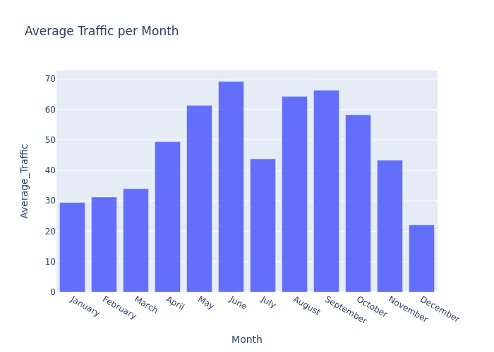
*Note: Graph above shows average hourly traffic per month*

Certain months have different amounts of mean traffic, so providing the model of the month will help it understand this correlation. I am using dummies from python in order to set up a column for each month.

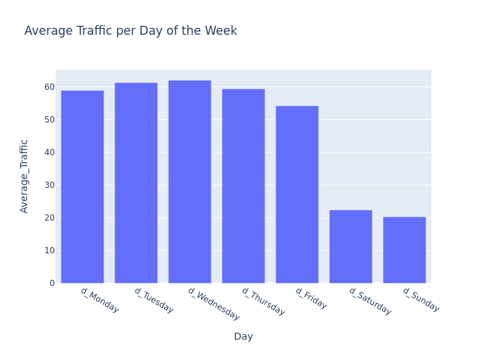
*Note: Graph above shows average hourly traffic per day of the week*

Certain days have different amounts of mean traffic, so providing the model the day will help it understand this correlation. I am using dummies from python in order to set up a column for each day.


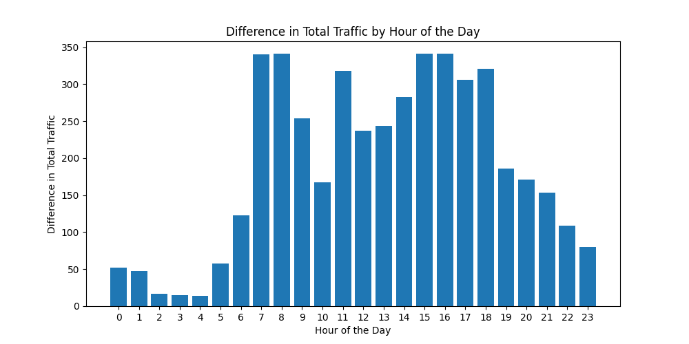

Certain hours differ in traffic amounts, and this will be a key aspect of the model to understand.

It is also important to note that within an hour, there is a lot of variation between the highest and lowest amounts. This proves that the model have to rely on other factors than time to determine traffic amounts, but perhaps for periods between 0-4 at night, the model could understand that it should guess low, regardless of weather conditions.

### Yearly variations of traffic data / Correlation of the two directions

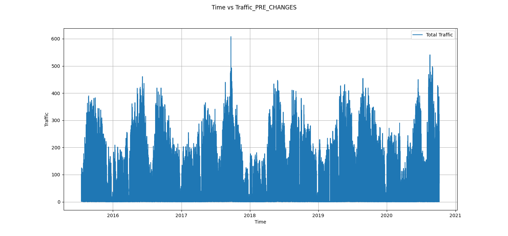

This graph visualizes traffic amounts over years, post processing


This graph also visualizes a large cycling peak in 2017, due to a large bicycle competition happening that year.
This is the cause of a great deal of outliers. The solution to this is removing data which sits in the 99th percentile. The model does not need to be good at guessing when the next large-scale bicycling competition is, it is more about day to day cycling.

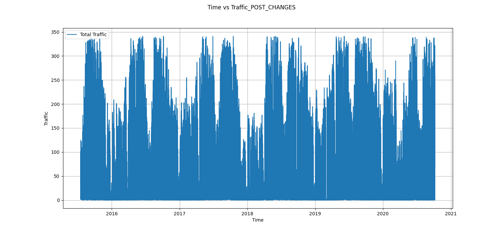


### Correlation matrix

**Raw-observation**

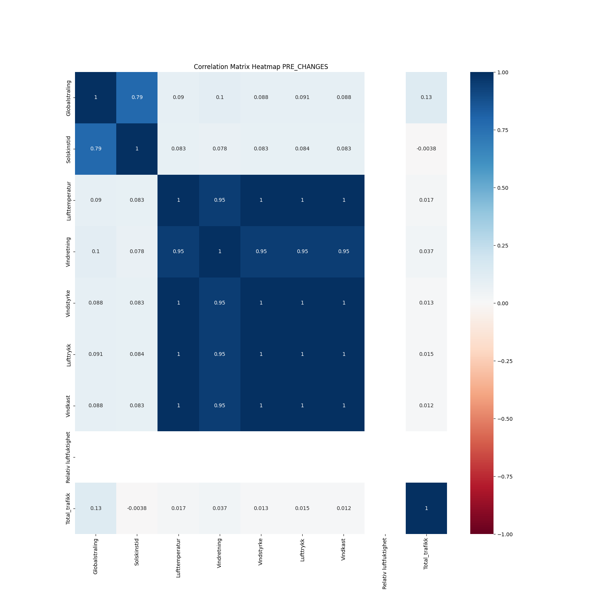

Looking at the *Corr matrix* graph above, it tells us that the data needs to be processed, as values are all over the place, most probably due to outliers.

**Post-processing**

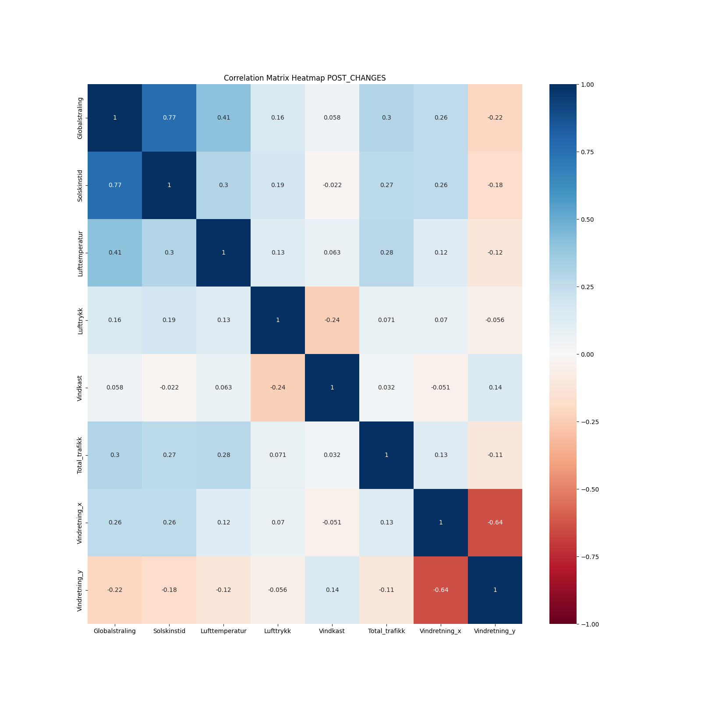

The variables *Globalstråling* and *Solskinnstid* have a high degree of correlation, at 0.68.
This is high, but not high enough that they tell us the same thing, so i am going to keep both variables. It is also important to note that both variables have a decent degree of correlation with *Total_trafikk*, so they could both be very important.

The variables *Lufttemperatur* and *Globalstråling* are also quite correlated, as expected, but they only have a pearson correlation of *0.41*, so keeping both values here, (especially since they both correlate so well with *Total_trafikk*) is the correct choice.

The variables which seem to have a good correlation with *Total_trafikk* are:

- Globalstråling (**0.30**)

- Solskinnstid (**0.27**)

- Lufttemperatur (**0.28**)

- Vindretning X/Vindretning Y (~ +/- **0.12~**)

### Data description:

-------------

| Statistics | Globalstraling | Solskinstid | Lufttemperatur | Vindretning | Vindstyrke | Lufttrykk | Vindkast | Relativ luftfuktighet | Total_trafikk |
| --- | --- | --- | --- | --- | --- | --- | --- | --- | --- |
| **Count** | 45746.00 | 45746.00 | 45746.00 | 45746.00 | 45746.00 | 45746.00 | 45746.00 | 0.0 | 45746.00 |
| **Mean** | 104.75 | 18.64 | 30.22 | 232.09 | 24.33 | 1023.43 | 26.23 | NaN | 51.48 |
| **Std Dev** | 390.46 | 403.22 | 415.11 | 421.44 | 413.80 | 368.96 | 410.02 | NaN | 71.34 |
| **Min** | -3.20 | 0.00 | -10.85 | 5.00 | 0.00 | 942.87 | 0.00 | NaN | 0.00 |
| **25%** | -0.67 | 0.00 | 4.47 | 153.00 | 1.44 | 997.42 | 2.55 | NaN | 5.00 |
| **Median/50%** | 4.47 | 0.00 | 8.58 | 168.17 | 2.62 | 1005.50 | 4.50 | NaN | 25.00 |
| **75%** | 105.36 | 0.00 | 13.07 | 292.67 | 4.20 | 1012.97 | 7.15 | NaN | 65.00 |
| **Max** | 9999.99 | 9999.99 | 9999.99 | 9999.99 | 9999.99 | 9999.99 | 9999.99 | NaN | 608.00 |

Doing a quick description of the data pre-processing, one can see that there is a lot of variation in the data, and all the columns have max values of 9999.99. This is due to missing values being labeled as 9999.99. At this state, since 9999.99 is used as missing data, it effects all the other columns, so data processing is needed.
Notably, ```Relativ luftfuktighet``` must be removed, as there is a lot of missing data.

**Description POST PROCESSING:**

After processing an treating NaN values, a lot more can be understood about the data

|       | Globalstraling | Solskinstid | Lufttemperatur | Lufttrykk | Vindkast | Total_trafikk | hour | Vindretning_x | Vindretning_y |
|-------|----------------|-------------|----------------|-----------|----------|---------------|------|---------------|---------------|
| count | 45290.00       | 45290.00    | 45290.00       | 45290.00  | 45290.00 | 45290.00      | 45290.00 | 45290.00      | 45290.00      |
| mean  | 88.72          | 1.29        | 8.77           | 1004.48   | 5.25     | 48.14         | 11.49   | -0.38         | 0.00          |
| std   | 163.15         | 3.02        | 5.73           | 12.47     | 3.48     | 63.31         | 6.95    | 0.71          | 0.58          |
| min   | -3.20          | 0.00        | -10.85         | 942.87    | 0.00     | 0.00          | 0.00    | -1.00         | -1.00         |
| 25%   | -0.67          | 0.00        | 4.42           | 997.33    | 2.55     | 5.00          | 5.00    | -0.94         | -0.58         |
| 50%   | 3.88           | 0.00        | 8.43           | 1005.33   | 4.50     | 25.00         | 11.00   | -0.82         | 0.21          |
| 75%   | 100.20         | 0.00        | 12.88          | 1012.80   | 7.13     | 63.00         | 18.00   | 0.35          | 0.45          |
| max   | 951.97         | 10.00       | 31.83          | 1039.82   | 25.83    | 341.00         | 23.00   | 0.99          | 1.00          |

Now the data makes more sense. From here we can we tell the data sits more realistically between values, and can be looked at in relation to traffic.

For each data point (globalstråling, solskinn ... etc) graphs and their correlation to traffic will be showed pre and post processing in order to show the transformation.
Data will also be statistically evaluated in relation to pearson and spearman correlation.

-------------

### Globalstråling

**Raw-observation**

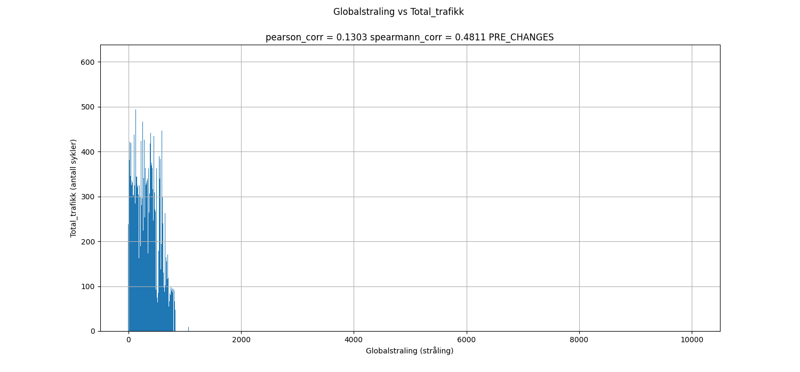

Looking at the figure above , it is clear that the data contains outliers, as a the amount of global radiation cannot exceed many thousands. [reference](https://www.sciencedirect.com/science/article/pii/S1364032116308115)


**Post-processing**

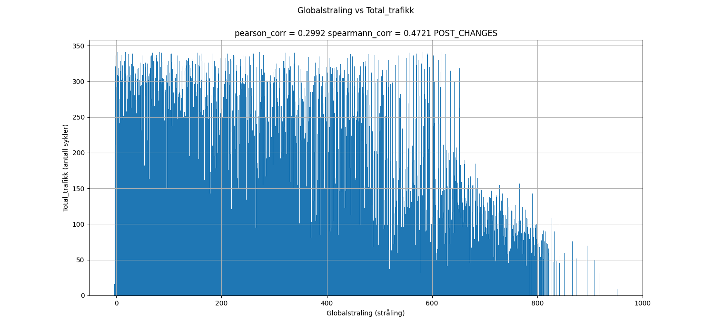

After processing this data, treating outliers, one can see that the data sits between values of .-4 to 900.

It is clear that there is some correlation between globalstråling and cycle-traffic.

There seems to be little difference in correlation when globalstråling lies between 0-400, but in values over this, and especially over 600, traffic decreases.

With a pearson correlation of *0.2985*, this is decently strong, but can still be a good indicator of correlation.

The spearman correlation value of *0.4716* is a good sign. Due to the nature of the data ``jumping"  up and down, (meaning that for one given globalstråling `n`, it can have values a 300, while `n+1` has 150, and `n+2` has 300 again). The spearman value may not be as useful here, as it is most useful when observing monotonic data.

-------------

### Lufttemperatur

**Raw-observation**

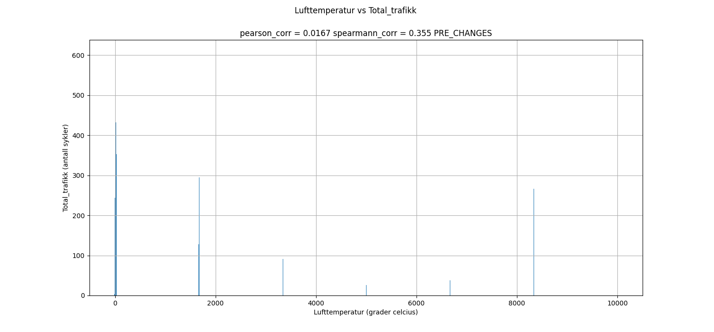

Looking at the figure above , it is clear that the data contains outliers, and the data seems to pool weirdly around certain values. This needs to be adjusted for.

**Post-processing**

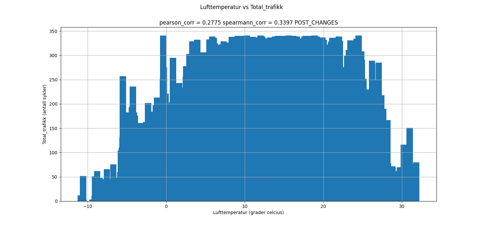

After processing this data, treating outliers, one can see that the data sits between values of -10-32.

It is clear that there is some correlation between temperature and cycle-traffic.

There seems to be little difference in correlation when lufttemperatur lies between 3-20, but in values over 20, and values under 3, traffic decreases.

With a pearson corr value of *0.2783*, this decently strong, but can still be a good indicator of correlation.

The spearman correlation value of *0.3405* is a good sign. However, this data is not monotic, as it goes up, then down later. This means that the spearman correlation cannot be trusted to a large extent.

-------------

### Lufttrykk

**Raw-observation**

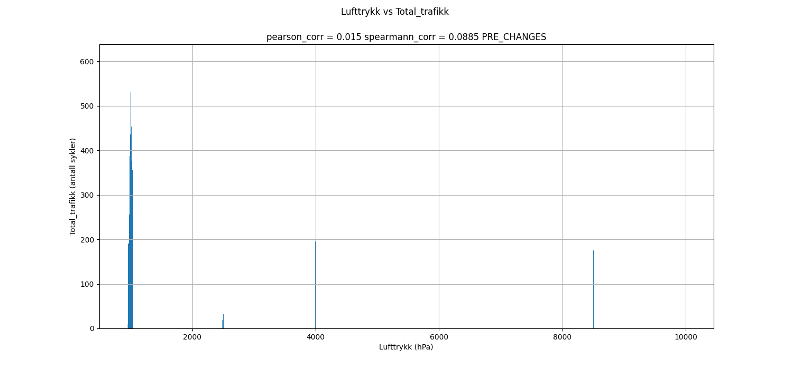

Looking at the figure above , it is clear that the data contains outliers, and the data seems to pool weirdly around certain values. This needs to be adjusted for.

**Post-processing**

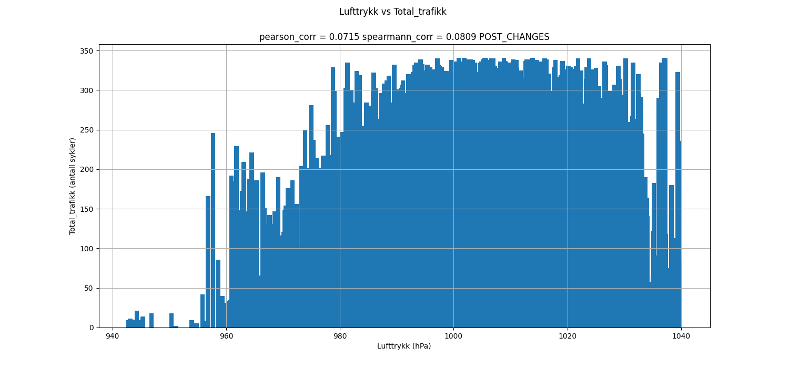

Looking at the *Lufttrykk vs Total Trafikk* graph above, it may seem like there is a correlation between the two. It seems that values around 980-1020 provide around the same amount of cyclists. Values higher than 1020 and lower than 980 causes a drop off inn traffic.

With a pearson corr value of *0.0714*, this is not very strong at all, despite what it may seem at first look.
The spearman correlation value of *0.0818* is also a bad sign, but the spearman corr may not be as good of an indicator as the pearson corr since this data is not monotonic.

-------------

### Solskinnstid

**Raw-observation**

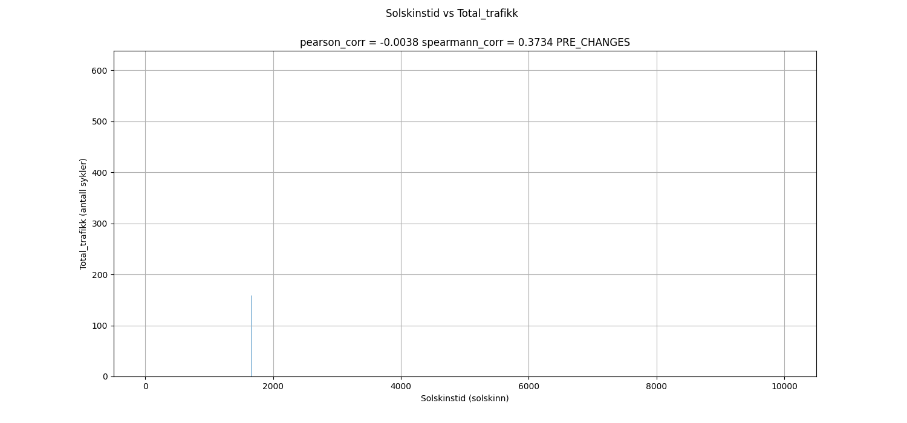

Looking at the figure above , it is clear that the data contains outliers, and the data seems to pool weirdly around certain values. This needs to be adjusted for.

**Post-processing**

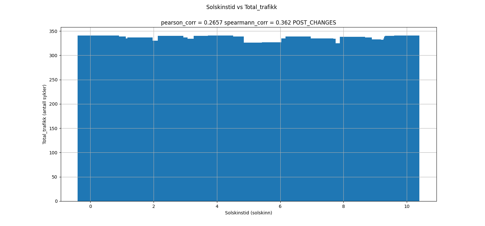

Looking at the *Solskinn vs Total Trafikk* graph above, it may be hard to spot a correlation between the two. It seems that solskinn does not effect the amount of cyclists.

However, with a pearson corr value of *0.2623* This indicates at least a causal correlation. This data will still be useful.
The spearman correlation value of *0.3616*  is ok, but the spearman corr may not be as good of an indicator as the pearson corr since this data is not monotonic.

-------------

### Vindretning

**Raw-observation**

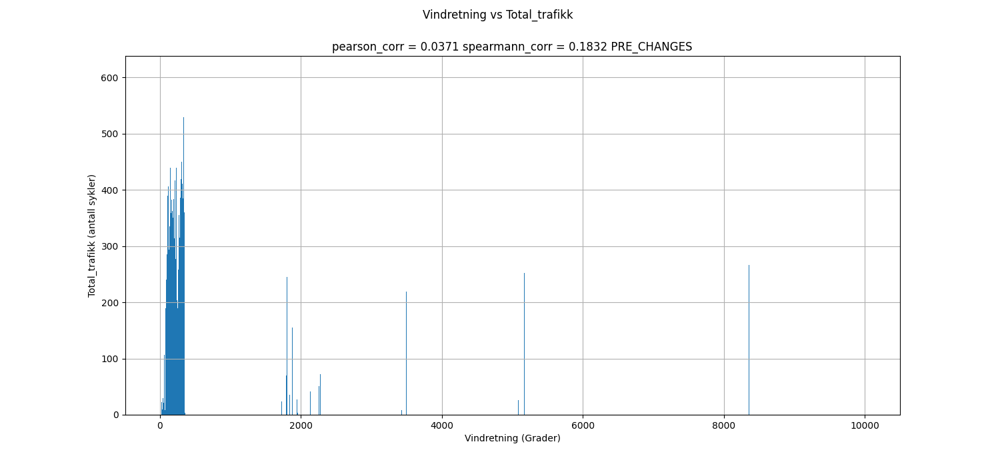

Looking at the figure above , it is clear that the data contains outliers, and the data seems to pool weirdly around certain values. This needs to be adjusted for.

**Post-processing**

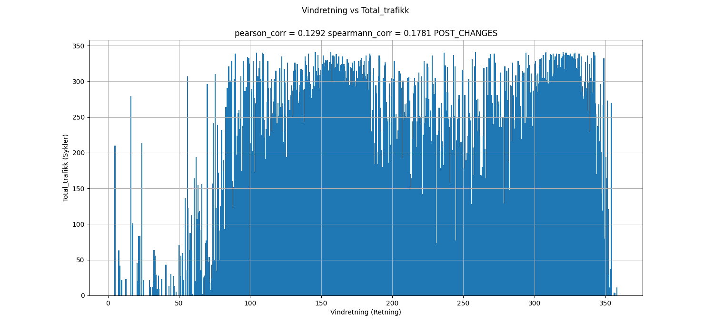

Looking at the *Vindretning vs Total_trafikk*  graph above, it is up for argument if there is a strong correlation between the two, but there is some data that can be useful.
It seems that between x=100-350 values are pretty much consistent, however a drop is seen at around 250. Values between 100-0 are also very low, and could be reflective of something else? Vindretning and traffic seem to be correlated, but these vindretning values can be further processed, to try to extract further data from the wind.  

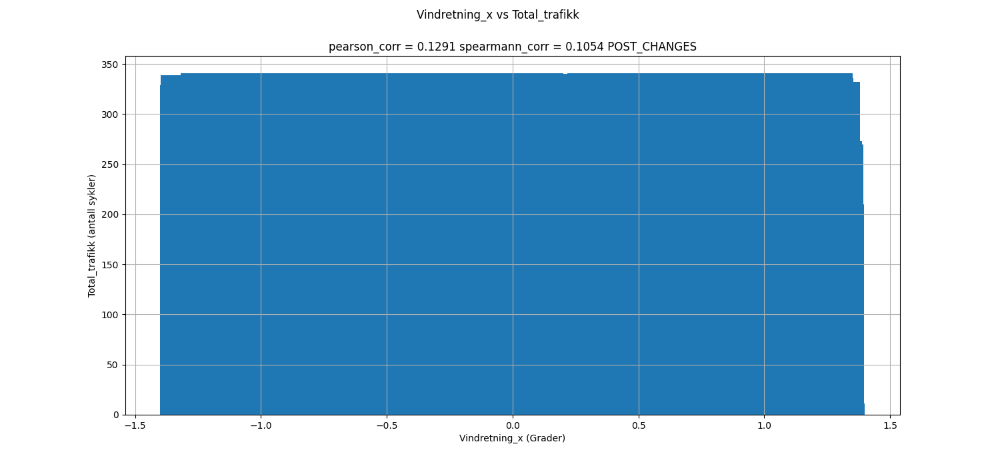

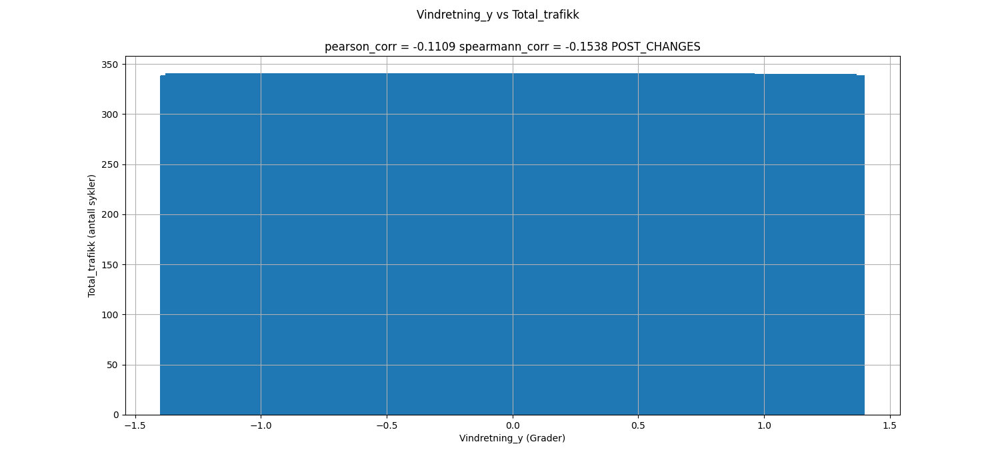

This data has been transformed quite a bit. Vindretning was originally a number between 0-360, and has transformed to two values. The degrees (0-360) can be imagined as points on a unit circle.
Converting this point to two separate values, x and y reveal more about the nature of the wind. Originally only the wind direction was known, but now the wind x and y directions are known, or atleast simulated.

Mathematically speaking:

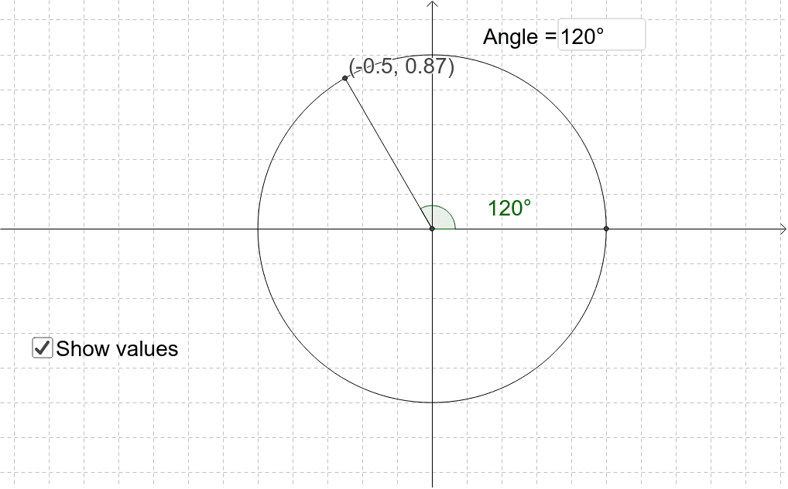

In the example above, if "Vindretning" was 120, then x would be -0.5 and y would be 0.87.

Looking at the *Vindkast x/y vs Total_trafikk* graphs above, it is not right away clear that vindkast has a correlation with cycle traffic.
The original undivided data had a slightly positive pearson correlation of *0.139*, but now after splitting the data in two, it is clear that *Vindretning_x* has a positive pearson corr of *0.1283* while *Vindretning_y* has a negative correlation of *-0.1107*. Splitting this value into two allowed us to gain a deeper understanding of this value, understanding that some vindretning is negatively correlated!
Since vindretning has been transformed to two different variables, the original "Vindretning" has been dropped.

-------------

### Vindkast

**Raw-observation**

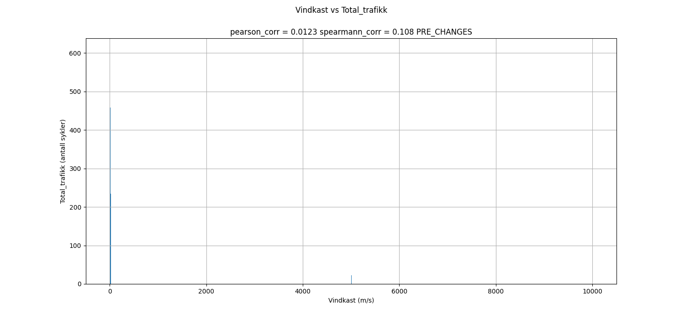

Looking at the figure above , it is clear that the data contains outliers, and the data seems to pool weirdly around certain values. This needs to be adjusted for.

**Post-processing**

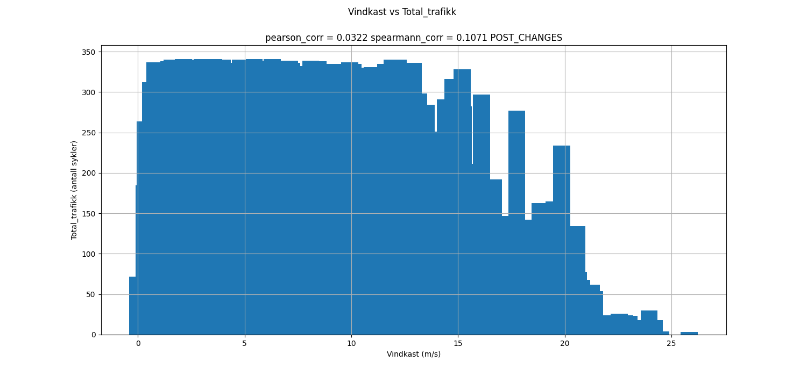

Looking at the *Vindkast vs Total_trafikk* graph above, it is clear that vindkast has a correlation with cycle traffic.
Values between 0-15 don't seem to effect traffic, but values above 15 m/s indicate strong winds and therefore we see a drop in traffic at these values.

However, with a pearson corr value of *0.0347*, this indicates quite a weak correlation. This data will still be useful.
The spearman correlation value of *0.109*  is ok, and since this data is somewhat monotonic, could tell us some correlation is present.

-------------

### Vindstyrke

**Raw-observation**

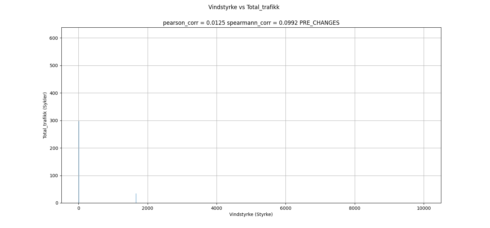

Looking at the figure above , it is clear that the data contains outliers, and the data seems to pool weirdly around certain values. This needs to be adjusted for.

**Post-processing**

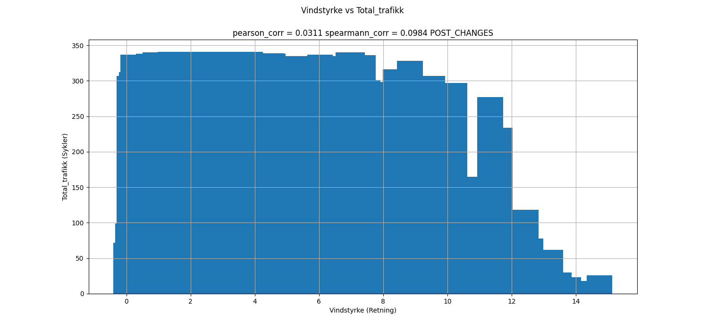


The *Vindkast* and *Vindstyrke* variables have a pearson correlation of 0.979, for the purpouses of the data, they tell us virtually the same thing.

*Vindstyrke* has a correlation of 0.0321 with *Total trafikk*,
while *Vindkast* has a correlation 0.0325 with *Total trafikk*.
*Vindstyrke* has a pearson correlation which is 0.004 less than *Vindstyrke*, this is almost nothing, but for the purpouses of this paper, i choose to keep *Vindkast*. It is also important to note that when two variables are so similar and correlate so well, it is like giving the model the same data two times, which can lead to unwanted effects, like the model over-weighting these two factors or otherwise under relying on one, and over relying on the other. When they tell the same story, there is no need to keep them both.

-----------

### Dropped columns

- *Vindstyrke*

<p>
Vindstyrke and vindkast have a high degree of correlation, and statistically, it is like having the same variable two times. The two variables also have a very similar correlation with traffic amounts. Vindstyrke was dropped, as vindkast had a slightly higher correlation to traffic.
<p>

- *Vindretning/Vindretning_radians*

<p>
These have been transformed to Vindretning_x and Vindretning_y which provide more information about the variables.
<p>

- *Relativ luftfuktighet*

<p>
Drop "Relativ luftfuktighet" as this data only exists in 2022 and 2023. While this would be very valuable, its hard to train a dataset with a lot of missing data.
<p>

- *Data in traffic files*

``` json

    columns=[
        "Trafikkregistreringspunkt",
        "Navn",
        "Vegreferanse",
        "Fra",
        "Til",
        "Dato",
        "Fra tidspunkt",
        "Til tidspunkt",
        "Dekningsgrad (%)",
        "Antall timer total",
        "Antall timer inkludert",
        "Antall timer ugyldig",
        "Ikke gyldig lengde",
        "Lengdekvalitetsgrad (%)",
        "< 5,6m",
        ">= 5,6m",
        "5,6m - 7,6m",
        "7,6m - 12,5m",
        "12,5m - 16,0m",
        ">= 16,0m",
        "16,0m - 24,0m",
        ">= 24,0m",
    ]

```

These columns do not really tell us much, and could really just confuse the model.


## Data processing

This section goes over the treatment of outliers, and other processing steps.

Values that were deemed as outliers such as "99999" were transformed into NaN.
Following this step, these NaN were transformed into real values by a KNNImputer, with settings *weights* = distance, since this pertains to date data. When mentioning that "x" data points were transformed to NaN, this includes the 99999 data points as well as those outside the borders specified in each section.
The KNNImputer looks at the data in the dataset, and figures out the "best-fitting value" for the NaN value for a given coloumn. 


| Column                | Number of NaNs |
|-----------------------|----------------|
| Globalstraling        | 85             |
| Solskinstid           | 94             |
| Lufttemperatur        | 169            |
| Vindretning           | 278            |
| Vindstyrke            | 169            |
| Lufttrykk             | 169            |
| Vindkast              | 169            |
| Relativ luftfuktighet | 45746          |

Right off the bat, as described earlier, Relativ Luftfuktighet is dropped as it only has values for certain years (2022-2023).

*Note: when describing how many values were transformed into NaN, this is in relation to training data, since thhat is the data that is looked at under data exploration.*

- *Globalstråling*

<p> Values over 1000 in **Globalstraling** are considered malformed. </p>
85 data points are transformed into NaN.

This value was chosen because values over this are only observed "ved atmosfærenses yttergrense"

[ref]("https://veret.gfi.uib.no/")

- *Solskinnstid*

<p>
Values above 10.01 in **Solskinstid** are are considered  malformed</p>
94 data points are transformed into NaN.

The solskinstid scale is between 0-10

[ref]("https://veret.gfi.uib.no/")

- *Lufttrykk*

<p>
Values above 1050 in **Lufttrykk** are considered malformed. </p>
169 data points turn into NaN.

168 and 1050 are the min/max records of all time.

[ref]("https://en.wikipedia.org/wiki/List_of_atmospheric_pressure_records_in_Europe")


- *Luftemperatur*

<p>
Values above 37 in **Lufttemperatur** are considered malformed. </p>
169 values are turned into NaN.

Over 37 degrees is not realistic for norway, as the warmest ever recorded was 35.6 degrees

[ref]("https://no.wikipedia.org/wiki/Norske_v%C3%A6rrekorder")

- *Vindkast*

<p>
Values above 65 in **Vindkast** are considered malformed </p>
169 values are considered NaN.

Over 65m/s is not realistic for norway, as the highest value ever recorded was 64,7m/s

[ref]("https://no.wikipedia.org/wiki/Norske_v%C3%A6rrekorder")

- *Vindretning*

<p>
Values above 360 in **Vindretning** are considered malformed </p>
278 values are lost.

Since vindretning is measured from 0-360, there is no way a degrees of more than 360 could be measured.

- *Vindstyrke*

Values above 1000 are considered malformed.

There are 169 missing values here, but this col is dropped in favour of "Vindkast" anyway, as they are so correlated.

- *Relativ luftfuktighet*

This column is dropped from the start, since there is so much missing data (56513 NaN values)

- Outliers in traffic data


Looking at traffic data above, a clear peak was the year 2017, where there was a cycling competition in bergen. These outliers may affect the data, as there is not a large-scale cycling competition every year.
Values in the 99th percentile were removed, in hopes of normalizing data each year, so that the model can understand trends across months, not a trend which occurred one year.

*For training data:*
Values pre removal of outliers: 45746
Values post removal of outliers: 45290

So 456 values were removed, so not a lot relative to the entire dataset.

This choice is a toss-up because the model will become generally better at guessing mean values, but will struggle on predicting high values.

This also removes the bottom 99th percentile, again making the model worse at guessing very low values, but better at general values. The hope is that the model is able to understand that at night there are less cyclists, through other variables/features.


Now after removing outliers, data is more uniform across years. There is still some variation, but the key visual outliers are treated.

# Feature engineering

### These features were added:

- *Hour*
<p> From the date, the hour was added as a column. This can help the model make a link between hour and traffic
</p>
Range: 0-24

-----------------------------------

- *Day_in_week*
<p> From the date, the day in the week was added, This will help the model make a link between days and traffic
</p>
Range: 0-7

-----------------------------------

- *Month*
<p> From the date, the month was added as a column. This can help the model make a link between time of year and traffic
</p>
Range: 1-12

-----------------------------------

- *Weekend*
<p> From the date, a 0/1 column for if it is a weekend or not was added. This can help the model make a link between time of week and traffic
</p>
Range: 0/1

-----------------------------------

- *Public_holiday*
<p> From the date, a 0/1 column for if it is a public holiday or not was added. This can help the model make a link between specials days of the year and traffic.
</p>
Range: 0/1

-----------------------------------

- *Raining*
<p> From the air pressure, a 0/1 column for if it is raining or not was added. Rain and air pressure are not directly linked, but it may be possible to guess weather from air pressure. Reference:

[Rain link]("https://geo.libretexts.org/Bookshelves/Oceanography/Oceanography_101_(Miracosta)/08%3A_Atmospheric_Circulation/8.08%3A_How_Does_Air_Pressure_Relate_to_Weather)

</p>
Range: 0/1

-----------------------------------

- *Summer*
<p> From the months, a 0/1 column that specified if it is summer or not was added (June-July)

</p>
Range: 0/1

-----------------------------------

- *Winter*
<p> From the months, a 0/1 column that specified if it is summer or not was added (October-February)

</p>
Range: 0/1

-----------------------------------

- *Rush hour*
<p> From the months, a 0/1 column that specified if the hour is a rush hour (7-9 and 15-17)

</p>
Range: 0/1

-----------------------------------

- *Nightime*
<p> From the months, a 0/1 column that specified if the hour is in the middle of the night (22-6)

</p>
Range: 0/1

-----------------------------------

- *Vindretning_x/Vindretning_y*
<p> Vindretning contains values between 0-360, and these are transformed to points on a circle


</p>
Range: -1/1

-----------------------------------

- *Total_trafikk*
<p> The numbers for the two rows of traffic were combined to one.

</p>
Range: N/A

-----------------------------------

### Considered Features that were decided against

- *Total traffic in retning Danmarkplass*,
- *Total traffic in retning Florida*,

<p> The reason adding this column does not work is, well, if we know how much traffic there is, there is no point in guessing how much traffic there is.
</p>

Range: N/A

-----------------------------------

- *Last_Total traffic in retning Florida*,
- *Last_Total traffic in retning Danmarksplass*,
- *Last_Total traffic*,

<p> This column would be the value for traffic in the previous row.
The reason adding this column does not work is that it is much harder to train the model when you have to train one line at a time, and use the last row's value's as training values.
This could also be a big problem because if we guess wrong on the last traffic, that value will be brought with to the next row's guess, and further for ALL the rows, and if that value is wrong, well then ALL the guesses are potentially wrong.
</p>

Range: N/A

-----------------------------------
- *Day in month*

<p> This column would tell us what day in the month it is, but this is a bit overkill considering the other values we have, and i dont expect traffic to fluctuate a lot between the start and the end of the month.
</p>

Range : 1-31


# RESULTS :

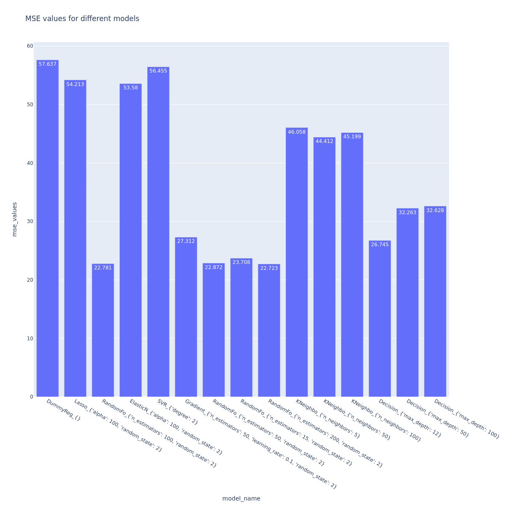

One can see that RandomForestRegressor with n_estimators; 200 is the best model with a RMSE of 22.723.

After finding the best model hyper-parameters were found.

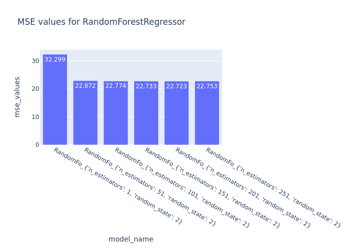

Seemingly, a higher n_estimators yield slightly better results.

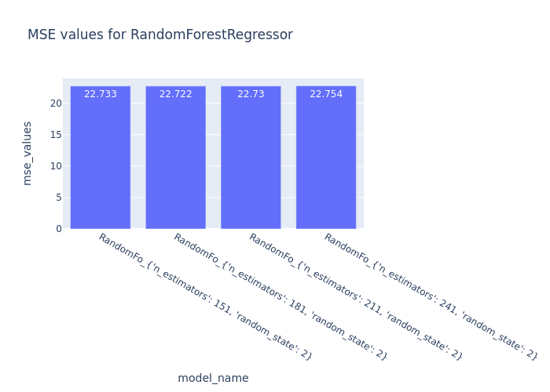

Attempting to optimize hyper-parameters even further, results show that 181 n_estimators was the best.

A deeper dive into the best hyper-parameters could have been done, however this amount of optimization already takes quite a while, and it would seemingly result in diminishing returns, as improvements made are very miniscule.

### Evaluating other models:

Other models did not perform as well as RandomForestRegressor

1. Elasticnet, SVR, and Lasso: *Linear models*

ElasticNet RMSE:53.58

SVR RMSE: 56.455

Lasso RMSE:54.213

Elasticnet and Lasso include regularization to prevent overfitting. These types of models may not do so well if the data is not only linear, which is the case for the relationship between some of the variables in the model. The non-linear nature of the data is apparent when looing at the data exploration section above.

2. KNeighborsRegressor: *Prediction based on "neighbours"*

KNeighborsRegressor RMSE:44.412

This model does not perform so well since there is no clear "cut" between if there are for example 30, or 31 cyclists. This model works better when predicting variables such as plant species, where variables will together align to place the predicted value in a "category". Since this data is more numerical rather than categorical the model struggles. Imagine the model is making several hundred "categories" for all possible outcomes of cyclists, and trying to place cyclists in a category. This model is trying to be "spot on correct" in a situation where it is more realistic to be "close enough". Since getting 100% correct predictions for such varying data would be very difficult.

3. DecisionTreeRegressor: *Tree based prediction*
DecisionTreeRegressor RMSE:26.725

This model is not doing half bad when compared to RandomForestRegressor, but it may be overfitting to the training data, creating many specific "rules", which are not valid anymore for unseen data. This is where randomforestregressor shines as it can use multiple trees to come up with a final prediction.
Source for above data: [link](https://www.kdnuggets.com/2022/08/decision-trees-random-forests-explained.html#:~:text=Random%20forests%20typically%20perform%20better,up%20with%20a%20final%20prediction.)


4. GradientBoostingRegressor: *Ensemble boosting model*
GradientBoostingRegressor RMSE:27.312

This model is not doing half bad when compared to RandomForestRegressor.
This model works buy building trees one at a time, where each new tree helps to correct the mistakes made by the previously trained tree.
This model may struggle since the data has a large variance in traffic, for example when looking at max and min cyclists for a given hour.

5. RandomForestRegressor: *Ensemble model*
RandomForestRegressor RMSE:22.721

This is an ensemble learning method that works by constructing multiple decision trees at training time and outputting the mean prediction of the individual trees. Having multiple trees may make the model take longer to train, especially as "n_estimators" increases. However, the model is a lot more robust to varying data due to the multiple trees.

8. DummyRegressor:

DummyRegressor RMSE: 57.637
Just a benchmark which always guesses the mean. Cannot learn anything.

--------------------------

After finding the best model and seeing how it performed on validation data, we can use the ```best_model.feature_importances_``` output to evaluate the importance of columns.

Model for test data = False

MSE: 516.276

RMSE: 22.721

| Feature        | Importance |
|----------------|------------|
| rush_hour      | 0.320274   |
| weekend        | 0.189272   |
| hour           | 0.111285   |
| Lufttemperatur | 0.104513   |
| sleeptime      | 0.067502   |
| month          | 0.053306   |
| Globalstraling | 0.035742   |
| Lufttrykk      | 0.024270   |
| Vindkast       | 0.020730   |
| Vindretning_x  | 0.017398   |
| Vindretning_y  | 0.015512   |
| Solskinstid    | 0.012013   |
| public_holiday | 0.009460   |
| d_Friday       | 0.006085   |
| summer         | 0.003759   |
| d_Monday       | 0.001981   |
| d_Thursday     | 0.001885   |
| d_Tuesday      | 0.001652   |
| d_Wednesday    | 0.001390   |
| winter         | 0.000850   |
| raining        | 0.000642   |
| d_Saturday     | 0.000247   |
| d_Sunday       | 0.000233   |

which is pretty good considering the ```DummyRegressor``` has a RMSE of ```RMSE: 57.63``` on validation data!

So, now that we have a model, we can try to tweak it, in order to get better results.
Of course, validation data will be used to see if the model is good or not. Test data is saved entirely for last.

*Changes to attempt*
- Adding dummy variables for months
- Data normalization
- Changing the n_neigbours for the KNNimputer
- Removing dummy variables for days
- Removing the raining column


### Adding dummy variables for months:

RMSE: 23.052

After changing the month column from being a number 0-11, to instead each month having their own column with value of either 0 or 1.

After this change, the RMSE increased by about 0.3, proving that adding dummy variables for the months did not decrease the RMSE.
It is also interesting to note that the same 5 variables stay the most important, but the month variables end up having vastly different importances.

*Important variables*

| Feature       | Importance |
|---------------|------------|
| rush_hour     | 0.320   |
| weekend       | 0.189   |
| hour          | 0.114   |
| Lufttemperatur| 0.107   |
| sleeptime     | 0.067   |

August is very important, while March is very unimportant.
When adding dummy variables for months, the summer variable becomes very unimportant, meaning that the model may lean more on the months rather than summer.
This feature may have worked in theory, as adding dummy variables for days does, however the month variables are better reflected in their own column, and through other variables such as summer/winter

### Data normalization
*Note: I learned that this is actually pointless for this model! See further in discussion*

These variables were changed to a 0-1 scale

"Globalstraling",
"Lufttrykk",
"Solskinstid",

The thought behind this is that since these values are all between 0-10 or in the case of Lufttrykk, 950-1050, changing to a 0-1 scale would help the model understand the difference between a high and low value.

And all values of "Vindkast" were taken to the second power.


The thought behind this is that since values between 0-15 do not affect traffic, but values between 15-25 do, it would be a way to make the model understand this.  

Results:

Model for test data = False

MSE: 541.193

RMSE: 23.263

| Feature        | Importance |
|----------------|------------|
| rush_hour      | 0.3202     |
| weekend        | 0.1892     |
| hour           | 0.1112     |
| Lufttemperatur | 0.1045     |
| sleeptime      | 0.0675     |
| month          | 0.0533     |
| Globalstraling | 0.0357     |
| Lufttrykk      | 0.0242     |
| Vindkast       | 0.0207     |
| Vindretning_x  | 0.0173     |
| Vindretning_y  | 0.0155     |
| Solskinstid    | 0.0120     |
| public_holiday | 0.0094     |
| d_Friday       | 0.0060     |
| summer         | 0.0037     |
| d_Monday       | 0.0019     |
| d_Thursday     | 0.0018     |
| d_Tuesday      | 0.0016     |
| d_Wednesday    | 0.0013     |
| winter         | 0.0008     |
| raining        | 0.0006     |
| d_Saturday     | 0.0002     |
| d_Sunday       | 0.0002     |

The model got worse, by about  a 0.5 increase in RMSE!

But looking at the importances, nothing changed! This made me run my base model again, since it is quite interesting that the model is worse but none of the feature importances changed.

I suspect data normalization may be a useful tool sometimes, but in this case it makes the model worse, as maybe while data is transformed, it is also lost.  

### Changing the n_neighbours for the KNNimputer

Baseline is n_neighbours = 20

After running the model with different n_neighbours, it results in this graph:

| n_neighbours | RMSE   |
| ------------ | ------ |
| 2            | 22.8670 |
| 10           | 22.7435 |
| 19           | 22.7801 |
| 20           | ***22.7217*** |
| 21           | 22.7677 |
| 23           | 22.7419 |
| 25           | 22.7919 |
| 30           | 22.7695 |

From these attempts, one can see that n_neighbours of 20 results in the lowest RMSE.

This implies that, when n_neighbours is too high or too low, it results in missing values filled in in a way that makes the model predict traffic values worse, compared to that of when n_neighbours is 20.

### Removing dummy variables for days

So far, I have taken the dummy variables for days as a given, but what if they actually are making the model worse?
Instead, day will just be a column with a number 0-6

Model for test data = False

MSE: 520.026

RMSE: 22.804

| Feature        | Importance |
|----------------|------------|
| rush_hour      | 0.3202     |
| hour           | 0.1113     |
| day            | 0.1066     |
| Lufttemperatur | 0.1046     |
| weekend        | 0.0948     |
| sleeptime      | 0.0675     |
| month          | 0.0532     |
| Globalstraling | 0.0358     |
| Lufttrykk      | 0.0244     |
| Vindkast       | 0.0208     |
| Vindretning_x  | 0.0175     |
| Vindretning_y  | 0.0156     |
| Solskinstid    | 0.0122     |
| public_holiday | 0.0094     |
| summer         | 0.0038     |
| winter         | 0.0008     |
| raining        | 0.0006     |

Removing dummy variables for days made the model worse.
The best RMSE is 22.7217, and removing dummy variables led to an RMSE of 22.81. Looking at previous model importances, the days did not seem to be very important, but trying without the days as dummies did provide insight into their importance.

### Removing 2020 and 2021

MSE: 527.666

RMSE: 22.970

2020 and 2021 were very different years due to the COVID-19 pandemic.

Completely removing these years led to a higher RMSE. The reason i bring this up is because if the goal is to predict 2023 data, it may be smart to drop these years since 2023 society resembles 2017-2019 society more than 2020-2021. However, removing so much data would probably do more harm than good, as traffic did not vary that much across these two years.


Simply graphing average traffic per hour for each year also reveals that while there is some variance between years, the general idea of traffic varying across months still stands.

Interestingly, the average amount of cycle traffic was slightly higher for 2020:

From the training data: (does not include 2021.)

| Year | Mean Traffic |
|------|--------------|
| 2015 | 50.576    |
| 2016 | 49.743    |
| 2017 | 49.109    |
| 2018 | 47.451    |
| 2019 | 54.560    |
| 2020 | 58.594    |


### Removing the raining column

MSE: 517.221
RMSE: 22.742

The idea behind the "raining" column is that when the air pressure is below 996, it may be a way to indicate rain.
This idea came from research below:
[Rain air pressure link]("https://geo.libretexts.org/Bookshelves/Oceanography/Oceanography_101_(Miracosta)/08%3A_Atmospheric_Circulation/8.08%3A_How_Does_Air_Pressure_Relate_to_Weather#:~:text=Increasing%20high%20pressure%20(above%201000,corresponds%20with%20cloudy%2C%20rainy%20weather.")

After removing the rain column, RMSE increased to
RMSE: 22.742. so an increase of 0.2. This proves that this column helped the model, it also implies that the idea of rain appearing below a certain air pressure, but does not actually prove it. It may be a complete coincidence.

### Adding a year column

Model for test data = False

MSE: 651.641

RMSE: 25.527

| Feature        | Importance |
|----------------|------------|
| rush_hour      | 0.3202     |
| weekend        | 0.1892     |
| hour           | 0.1112     |
| Lufttemperatur | 0.1013     |
| sleeptime      | 0.0675     |
| month          | 0.0529     |
| Globalstraling | 0.0336     |
| Lufttrykk      | 0.0222     |
| year           | 0.0181     |
| Vindkast       | 0.0174     |
| Vindretning_x  | 0.0148     |
| Vindretning_y  | 0.0131     |
| Solskinstid    | 0.0110     |
| public_holiday | 0.0092     |
| d_Friday       | 0.0058     |
| summer         | 0.0038     |
| d_Monday       | 0.0018     |
| d_Thursday     | 0.0016     |
| d_Tuesday      | 0.0013     |
| d_Wednesday    | 0.0011     |
| winter         | 0.0007     |
| raining        | 0.0006     |
| d_Saturday     | 0.0002     |
| d_Sunday       | 0.0002     |


Adding the year as a column seems to make the model worse. This may make sense as the amount of traffic does not vary greatly across years. The one may have been 2017, but this has been evened out, as can be seen above.

--------------------------------------

After experimenting, the final model is:

**RandomForestRegressor with n_estimators = 181 with an RMSE of 22.7217**


### TEST DATA :

After experimenting and finding the best model for this use case, the model was checked against test data, to see if the model can actually generalize, or if it is just good at the training and validation data.

Model for test data = True

MSE: 570.360

RMSE: 23.882

| Feature        | Importance |
|----------------|------------|
| rush_hour      | 0.3202     |
| weekend        | 0.1892     |
| hour           | 0.1112     |
| Lufttemperatur | 0.1045     |
| sleeptime      | 0.0675     |
| month          | 0.0533     |
| Globalstraling | 0.0357     |
| Lufttrykk      | 0.0242     |
| Vindkast       | 0.0207     |
| Vindretning_x  | 0.0173     |
| Vindretning_y  | 0.0155     |
| Solskinstid    | 0.0120     |
| public_holiday | 0.0094     |
| d_Friday       | 0.0060     |
| summer         | 0.0037     |
| d_Monday       | 0.0019     |
| d_Thursday     | 0.0018     |
| d_Tuesday      | 0.0016     |
| d_Wednesday    | 0.0013     |
| winter         | 0.0008     |
| raining        | 0.0006     |
| d_Saturday     | 0.0002     |
| d_Sunday       | 0.0002     |


### Results discussion:

**BEST MODEL**: 

**The chosen best model was "RandomForestRegressor" with an *n_estimators* of 181 which has an RMSE of 22.7217 on validation data and 23.8822 on test data**


### Exploring Results achieved with a RandomForestRegressor model

The results present a model which is surprisingly good, considering the amount of variance in the data.

Simply comparing it to a DummyRegressor, the model is a lot better, as the DummyRegressor gets a RMSE on validation data of: 57.637

Looking at the predicted values for 2023, the model picks up on a few key things.

- In the middle of the night (22:00-04:00), traffic drops to 1/2 cyclists.
- During rush hour (07:00-09:00) and (14-17:00) the traffic shoots to 200, and to even higher numbers if the weather is nice.
- There is a smaller amount of traffic between (09:00-14:00) and (17:00-22:00)

The model seems to get the general gist of what causes cyclist traffic to vary, but predicting the exact values is almost an impossible task. A good way to represent this is graphing the difference between the highest and lowest traffic value for each hour (on training data)


This exemplifies how much the traffic varies, and how daunting of a task it would be to guess exact values.

The amount of variables one could imagine could have an effect on traffic are almost endless. One could imagine a column which was "% of votes for MDG'' in the past voting year. This could have an effect on the amount of people cycling, as more people voting "green" could reflect an increasingly cycle-friendly culture. The point is, given the data, I am impressed that the model is this "close" to reality.

The model is not exact, but this is due to the numbers never being "exact" in reality, and an RMSE of around 20 is very reasonable.

It is important to note that the test RMSE was baout 1.1 higher than the validation RMSE. This means that the model may have overfitted slightly to the training/validation data. However, this increase is very minimal and still shows the model is able to generalize.


----------------------------

### Model improvements

Given enough time and data, the model could be improved upon in a variety of ways. Choosing a more complex, model which is made to excel in data over time, could improve the model.
More data such as the actual amount of precipitation, the amount of ice on the ground, the current news scene, or data around COVID-19 restrictions could have made the model better.

I think a RandomForestRegressor with an even more well-tuned *n_estimators* could make the model marginally better aswell, but this is held back by training time.

A possible improvement would be to calculate hour or months as a points on a circle using sin/cos. This would allow the model to understand the circular nature of time. A scale from 0-30 works, but the model may struggle to understand that 30 and 0 are "next to each other" in terms of time.

An interesting idea for pre-processing would be instead of taking the mean of weather data (per 6 values per hour), other types of processing could occur.
Some idea would be:
Taking the median of certain values, or sum of others.
The sum could be good for values such as "Solskinstid" because a high value would imply a lot of sun across the whole of the hour, while lesser values would imply less sun for the whole hour, but still some sun.
For certain values with a lot of variance, the median would also better represent the values for the hour. If the temperature was `0,0,0,0,0,10` it would probably be best to choose 0 for that hour's temperature.

After consulting with the professor, it was found out that when using RandomForestRegressor, normalizing data does not actually help the model, due to the way the model works. This is outside the scope of this course, but is a very important take-away nonetheless.


### Website

The idea of the website was easy, but implementing its key features proved a challenge. Allowing a user to input all data, led to having to "build" their input as a dataframe before passing it to the predictor.
The predictor takes some time to build, so the library `pickle` was used to save the model after its creation. The model is too large to upload to git, let alone any other service, so for first time use, there may be a little bit of waiting time as the model is created.
The website allows all fields to not have values, except the date. The date is something that  is hard to be predicted by a KNNimputer. It is possible, but requires data represented in a different format, rather than the datetime format this project uses. Imagine being given weather and being asked "what day is this". This would be a fun task, but is perhaps out of the scope of this project.
The KNNimputer (for the training data) was saved as a pickle file, so that the webiste needs to predict missing values from the user, it refers to this imputer. The KNNImputer looks at the data in the dataset, and figures out the "best-fitting value" for the NaN value for a given coloumn. 

### Predictions.csv

For the prediction files, the values for the "Prediksjon" column was changed to be ints. For the whole prediction process, the model works with floating point numbers, however for the final predictions, they were rounded up to ints. This is because there is never a case where 3 and a half cyclists cycle over the bridge.

### Real world implications:

While this model works for nygårdsbroen, i would imagine it would not generalize well to other bridges or cycle traffic areas. This is because the amount of cycle traffic varies os greatly. For example looking at a bridge further out towards Fana, oen would imagine that cycling peaks earlier and later since people going to work corss it earlier, and later since the people going home from work may cycle there later. Also the amount of cyclists in this bridge is very specific, and the numbers for other birdges will vary greatly. 


### Conclusion:

After performing data analysis, feature engineering, and data transformation, this project explored an approach to creating a somewhat accurate model for approximating cycling traffic given the weather conditions.

